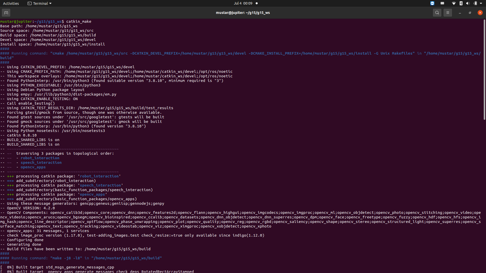
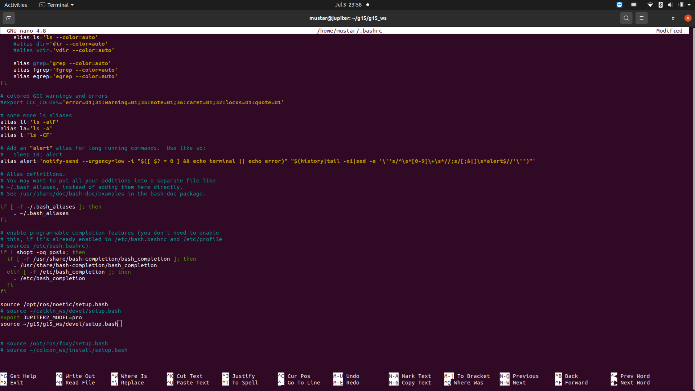
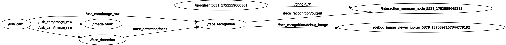

## Prerequisites

- Ubuntu 20.04
- ROS Noetic installed
- Packages used:
  - `usb_cam`
  - `opencv_apps`
  - `robot_interaction` (custom package)
  - `speech_interaction` (custom package)

---

## Step 1: Create and Build ROS Workspace

```bash
mkdir -p ~/catkin_ws/src
cd ~/catkin_ws/
catkin_make
```


## Step 2: Source Workspace in `.bashrc`
```bash
echo "source ~/catkin_ws/devel/setup.bash" >> ~/.bashrc
source ~/.bashrc
```


## Step 3: Add Packages to `src/`
```bash
cd ~/catkin_ws/src
git clone https://github.com/aiyyra/robot-menu.git
cd ..
catkin_make
```

## Step 4: Run the System with One Command
```bash
roslaunch robot_interaction app_launcher.launch
```

## Step 5: Verify the System
```bash
rqt_graph
```


## Common Issues

    Nodes not executable: Run chmod +x script.py inside your package's scripts/ folder

    Missing packages: Use rosdep install to install dependencies

    Topics not publishing: Check rosnode list and rostopic list for debugging

## try 
Steps to start our system manually:

1. roscore


2. roslaunch usb_cam usb_cam-test.launch (we connect robot to camera by USB)


3. roslaunch opencv_apps face_recognition.launch image:=/usb_cam/image_raw (could adjust .launch file to train) 


4. rosrun robot_interaction RobotInteractionManager.py


5. rosrun speech_interaction google_sr.py


